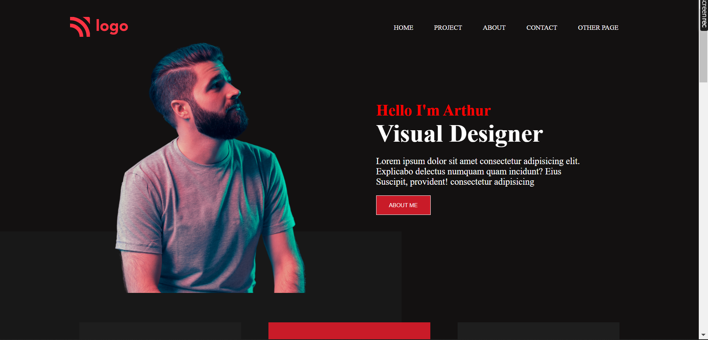
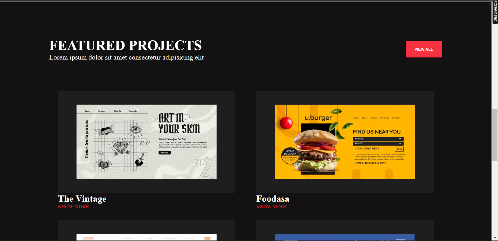

# Project 15 | HTML and CSS | Visual Desighner Home page

By prajwal zingare

---

 

---

## What I learned from this Project

- I learned how to adjust image and text.
- I learned how to put diffrent color conatiner at behind of all container using z-index property.
  ## Time required for finishing the peoject
- It takes me near about 3 hours to complete the project.